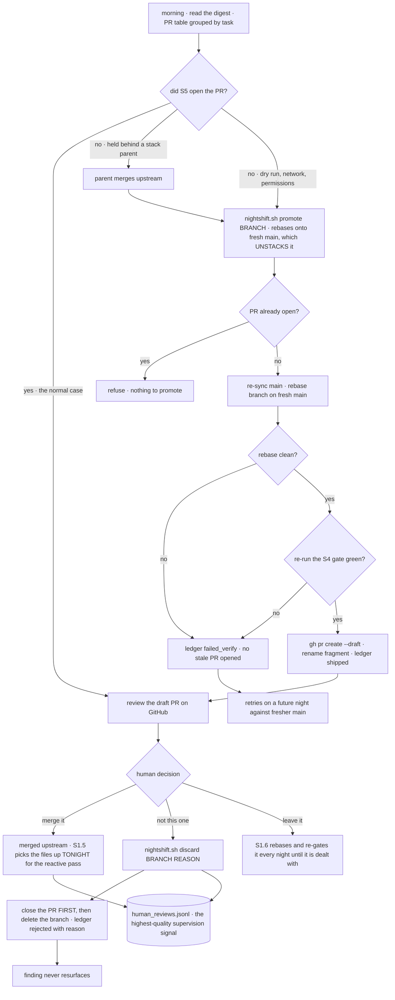
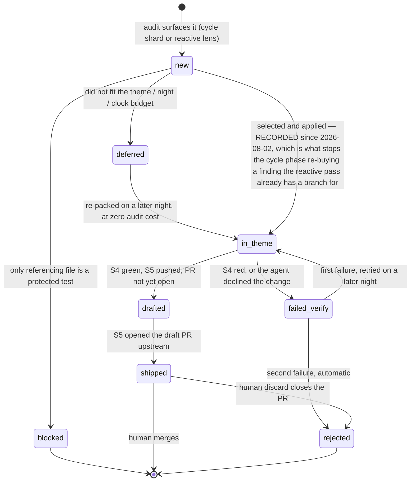
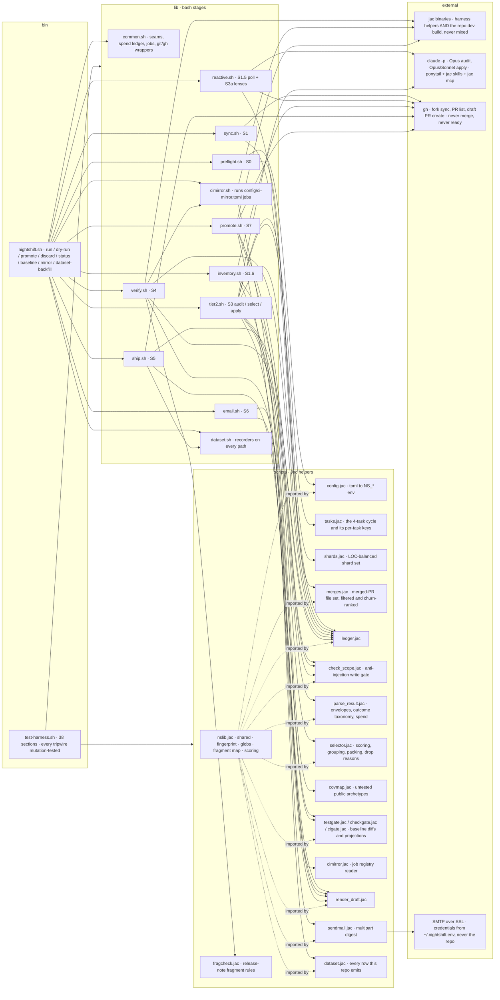

# Nightshift — Workflow

End-to-end map of the harness as it actually runs, current as of the v2 cutover (2026-08-02):
four task lenses cycling nightly over a whole-repo sharded audit, a reactive pass over what merged
upstream that day, an S4 gate that replicates locally the CI jobs a fork PR cannot reach, and draft
PRs opened automatically at the end of the night.

Stages `S0 – S6` run nightly and unattended. `S7` is the human loop, and it is now mostly *review
on GitHub* — S5 opens the PRs itself.

Design of record: `docs/superpowers/specs/2026-07-30-nightshift-4task-design.md`. Cross-plan
overrides: `docs/superpowers/plans/RECONCILIATION.md`. Open items:
`docs/superpowers/specs/2026-07-30-nightshift-followups.md`. `docs/PRD.md` and
`docs/TechnicalPRD.md` are pre-restructure and superseded for S3 onward (they carry banners saying
so).

**There is no S2.** Tier-1, the deterministic autofix stage, was retired 2026-07-30: a byllm-only
formatting PR was noise, a repo-wide one unmergeable (~259 pre-existing violations on main), and
upstream only checks formatting repo-wide on push. Themes format their own edits now, and
`[jobs.fmt]` gates that diff-scoped, exactly as CI does on a PR. The stage numbering keeps the gap
rather than renumbering, so every log line and spec reference written before that date still reads
true.

## 1. Nightly pipeline (S0 → S6)

```mermaid
flowchart TD
    LA["launchd 23:00 · user domain · direct exec of ~/nightshift/bin/nightshift.sh run"] --> FIRE["append date to ~/Library/Logs/nightshift-fired.log"]
    FIRE --> CAF["caffeinate -i"]
    CAF --> CEIL["gtimeout 480m · 23:00 to 07:00 · lockstep with budgets.wallclock_min"]
    CEIL --> S0

    subgraph S0["S0 · Preflight"]
        direction TB
        LOCK["mkdir lock · check ~/.nightshift/DISABLE"]
        GATE0{"disabled or lock held?"}
        DEPS["resolve jac / jac_repo / claude / gh / git · gh auth · network probe"]
        NET{"online and gh authed?"}
        PONG{"claude -p pong ok?"}
        MISS["missed-night scan · launchd fired but no run dir vs never fired"]
        LOCK --> GATE0
        GATE0 -->|"yes · FATAL_REASON written"| EXIT
        GATE0 -->|"no"| DEPS --> NET
        NET -->|"no · exit 43"| EXIT
        NET -->|"yes"| PONG
        PONG -->|"no · exit 42"| EXIT
        PONG -->|"yes"| MISS
    end
    MISS --> S1

    subgraph S1["S1 · Sync"]
        direction TB
        SYNC["gh repo sync fork from upstream main"]
        CONF{"main diverged?"}
        WT["worktrees · work/repo on branches · work/drafts on orphan"]
        PRUNE["prune shipped/rejected branches older than 14d"]
        PULL["pull ledger.jsonl from drafts branch"]
        SYNC --> CONF
        CONF -->|"yes · exit 44"| EXIT
        CONF -->|"no"| WT --> PRUNE --> PULL
    end
    PULL --> S15

    subgraph S15["S1.5 · Merge poll · agent-free"]
        direction TB
        POLL["gh pr list · merged upstream since last successful poll · read-only"]
        PQ{"did the query answer?"}
        SCOPE15["union of changed files · .jac only · protected globs dropped · rank by churn · cap 40"]
        NOANS["failed.tsv row · no reactive scope tonight"]
        POLL --> PQ
        PQ -->|"no"| NOANS
        PQ -->|"yes"| SCOPE15
    end
    SCOPE15 --> S16
    NOANS --> S16

    subgraph S16["S1.6 · PR inventory · agent-free · BEFORE any new work"]
        direction TB
        LIST["gh pr list · own open PRs · filter to nightshift/ prefix"]
        IQ{"query and projection both ok?"}
        REGATE["per PR, bounded by the clock · rebase on fresh main · re-run the S4 gate"]
        DEMOTE["red · never demotes an already-open PR · records and moves on"]
        INOK["pr-inventory.jsonl · existing PRs outrank fresh findings"]
        LIST --> IQ
        IQ -->|"no · did NOT run, not empty"| S3
        IQ -->|"yes"| REGATE
        REGATE -->|"green"| INOK
        REGATE -->|"red"| DEMOTE
    end
    INOK --> S3
    DEMOTE --> S3

    subgraph S3["S3 · agentic clean · priority order top to bottom"]
        direction TB
        S3A["S3a · REACTIVE · 4 lenses over the merged file set · cap $8 per lens · optional SWEEP merges 3 of them into 1 session"]
        CARRY["carry-over · findings a past night banked but could not apply · no audit cost"]
        S3B["S3b · CYCLE · tonight's ONE task, rotating dead-code, abstraction, maintenance, coverage"]
        SHARD["8 LOC-balanced shards of the whole repo · concurrency 2 · cap $12 per shard"]
        AUDIT["claude -p AUDIT · Opus, or Sonnet for shards named in [shards].sonnet_shards · read-only · 130 turns · 20 min box"]
        PJSON{"parse_result merge · any shard produced valid findings JSON?"}
        DEAD["a session that DIED is a dead lens · never salvaged into 0 findings"]
        SEL["selector · drop ledger-known / protected / blocked-by-protected-test / twice-failed · score · group by file+dir · pack at most 15 themes · fit clock"]
        BASE["pick the base · a theme sharing a file with one already applied tonight stacks on it, else main"]
        APPLY["per theme · branch cut from that base · fresh claude -p APPLY · acceptEdits · scoped tools · NO push/gh/network"]
        MODEL{"complexity routes attempt 1"}
        RJSON{"report JSON ok and diff non-empty?"}
        FRAG["release-note fragment 0000.kind.md · ledger upsert-theme · green queue"]
        CEIL3{"night_budget_usd 50 reached?"}
        S3A --> CARRY --> S3B --> SHARD --> AUDIT --> PJSON
        AUDIT -.->|"unfinished:*"| DEAD
        PJSON -->|"no · nothing ships tonight"| S4
        PJSON -->|"yes"| SEL --> BASE --> APPLY --> MODEL
        MODEL -->|"trivial / mechanical"| SONNET["Sonnet"]
        MODEL -->|"judgement"| OPUS["Opus"]
        SONNET --> RJSON
        OPUS --> RJSON
        RJSON -->|"no · or the agent declined"| DROP3["delete branch · ledger failed_verify · decline kept as data"]
        RJSON -->|"yes"| FRAG
        FRAG --> CEIL3
        CEIL3 -->|"yes · stop the fan-out"| S4
        CEIL3 -->|"no · next theme"| APPLY
    end
    FRAG --> S4
    DROP3 --> S4

    subgraph S4["S4 · Verify gate · fail-closed · per queued branch · cheap jobs first"]
        direction TB
        VB{"resolve the base · logs, then drafts, then main · parent gone = cascade red"}
        SCOPE{"scope contained? · diff FROM THE BASE subset of theme files + fragment · protected globs rejected unless the TASK carries protect_unless"}
        CHK{"jac check baseline-diff ok? · new errors vs main only · deleted .jac excluded from both sides"}
        FAST{"CI mirror fast jobs · fmt diff-scoped · check · jir · seconds"}
        TST{"mirrored CI suites per gated suite · baseline-diff · one retry each"}
        PC{"pre-commit ok? · self-mutation folded into the commit"}
        CTRB{"contribution rules · AI co-author · no .py · bun lockstep · docs · fragment"}
        RAN{"POSITIVE assertion · did the suite / the checker actually RUN?"}
        DISCARD["delete branch · ledger failed_verify++ · failed.tsv"]
        GREEN["green.tsv · record tests line · tune verify_estimate"]
        VB -->|"parent deleted"| DISCARD
        VB -->|"resolved"| SCOPE
        SCOPE -->|"no · possible injection"| DISCARD
        SCOPE -->|"yes"| CHK
        CHK -->|"no"| DISCARD
        CHK -->|"yes"| FAST
        FAST -->|"red · seconds, not 40min"| DISCARD
        FAST -->|"green"| TST
        TST -->|"red x2"| DISCARD
        TST -->|"green"| RAN
        RAN -->|"no · exit 0 meant nothing ran"| DISCARD
        RAN -->|"yes"| PC
        PC -->|"red"| DISCARD
        PC -->|"green"| CTRB
        CTRB -->|"red"| DISCARD
        CTRB -->|"green"| GREEN
    end
    GREEN --> S5

    subgraph S5["S5 · Ship · draft PR upstream"]
        direction TB
        PUSH["git push fork · explicit refspec · nightshift/* only · never force"]
        DRAFT["render_draft · drafts/DATE--slug.md"]
        STK{"stacked on another branch?"}
        HELD["branch pushed and drafted · PR HELD · prs.jsonl says held-behind-parent · promote opens it once the parent merges"]
        PR5["gh pr create --draft --repo upstream · POSITIVE assert on rc AND a URL-shaped result"]
        REN["rename fragment 0000 to PR-number · push · the PR updates itself"]
        ROW["prs.jsonl row · ledger shipped + pr_url"]
        PUB["commit + push drafts branch and ledger"]
        PUSH --> DRAFT --> STK
        STK -->|"yes"| HELD
        STK -->|"no"| PR5
        PR5 -->|"no URL"| FAILPR["ns_fail · prs.jsonl row pr-create-failed · other branches continue"]
        PR5 -->|"URL"| REN --> ROW
        ROW --> PUB
        FAILPR --> PUB
        HELD --> PUB
    end
    PUB --> S6

    EXIT["EXIT trap · fires on EVERY exit path, TERM and INT included"] --> S6
    DISCARD -.->|"all failed · exit 51"| EXIT

    subgraph S6["S6 · Email digest · always, and never aborts the trap"]
        direction TB
        SUMM["sendmail summarize · the night's OWN artifacts · clock from first_start_epoch"]
        DRY{"dry-run?"}
        SEND{"smtp SSL send ok? · server receipt required"}
        RENDER["print message · no send · dry-run banner above the stub links"]
        BAN["EMAIL_FAILED marker + osascript banner"]
        OK["multipart/alternative delivered · SMTP_RECEIPT written · credentials scrubbed"]
        SUMM --> DRY
        DRY -->|"yes"| RENDER
        DRY -->|"no"| SEND
        SEND -->|"yes"| OK
        SEND -->|"no"| BAN
    end

    %% data stores
    LEDGER[("state/ledger.jsonl.cache · fingerprint to status")]
    STATE[("state/state.json · cycle_index · verify_estimate · last_merge_poll")]
    STACK[("logs/DATE/stack.tsv + claims.tsv · branch to base · ORCHESTRATOR-written, never a theme key")]
    SPEND[("logs/DATE/spend.txt · session_id TAB cost · retry-complete")]
    DS[("dataset/*.jsonl · nights · audit_findings · refactors · sessions")]
    DRAFTSB[("nightshift/drafts orphan branch · drafts/*.md + themes/*.json + ledger")]
    PULL -.->|read| LEDGER
    SEL -.->|read| LEDGER
    FRAG -.->|write| LEDGER
    DROP3 -.->|write| LEDGER
    BASE -.->|write| STACK
    VB -.->|read| STACK
    GREEN -.->|tune| STATE
    S3B -.->|advance| STATE
    POLL -.->|stamp| STATE
    AUDIT -.->|charge| SPEND
    APPLY -.->|charge| SPEND
    CEIL3 -.->|read| SPEND
    ROW -.->|write| LEDGER
    ROW -.->|append| DS
    DROP3 -.->|append as a decline| DS
    SUMM -.->|append night row| DS
    PUB -.->|push| DRAFTSB
```

## 2. Human loop (S7)

S5 opens the draft PRs, so the morning job is review on GitHub, not dispatch. `promote` is the
manual fallback for a branch whose PR could not be opened; it refuses outright if one already
exists. **Nightshift never marks a PR ready for review** — `ns_gh_write` refuses `pr ready` and
`pr merge` outright. A human merges, or nobody does.

## 3. Finding lifecycle

Every finding is remembered across nights so work is never re-litigated. The fingerprint is
`sha1(file + rule)`, stable across nights and across both phases.

## 4. Component and data map

bash sequences processes; Jac owns every data and logic transformation. **No Python files** — a
standing project rule, enforced by the S4 contribution job on every branch.

Two jac binaries exist and are never mixed: `$NS_PATHS_JAC` runs the harness's own helpers,
`$NS_PATHS_JAC_REPO` is the dev build inside `work/repo` and is the only one that touches the
target repo.

## 5. Stacked branches

Added 2026-08-02. `[repo].stacked_prs = true`; set it false and the next night is the old
behaviour, no revert needed.

**The problem.** Themes are grouped by `task + directory`, so one night's *cycle* themes are
disjoint by construction — a file lives in exactly one directory. The *reactive* pass breaks that:
it runs all four task lenses over the **same** merged file set, so `dead-code-cli-commands` and
`abstraction-cli-commands` claim identical files. Branched independently off main, both gate green
in isolation and then collide upstream — or the second silently reverts the first.

**The mechanism.** When a theme claims a file another theme already claimed tonight, its branch is
cut from that branch instead of main, and the S4 gate measures its diff from there. Everything else
is unchanged: a theme sharing nothing with anything still bases on main, which *is* the old
behaviour, and that remains the overwhelming majority of branches.

The base lives in `logs/<date>/stack.tsv`, orchestrator-written, and is copied to the drafts branch
so a later night can re-gate the branch. **It is deliberately not a theme key** — the theme is
agent-authored JSON, and a base is a permission: it decides which part of a diff the scope gate
treats as already-reviewed. An agent that could name its own base could name a distant ancestor and
have its entire diff read as inherited. Same reasoning as `[tasks.*].protect_unless`.

**What does *not* move to the base**, on purpose: the jac-check main side, the test baseline, and
suite routing. The parent passed the same gate, so main is the same answer by a shorter route — and
where it differs, it differs strictly.

**Two costs, both deliberate.** A stacked child's PR is *held*: GitHub's `--base` must name a branch
in the repo the PR is opened on, and the parent lives on the fork while the PR belongs upstream.
Opening it upstream against main would ship a PR whose diff contains the parent's unreviewed work;
opening it on the fork produces a PR nobody sees. So the branch is pushed, gated, drafted and
inventoried, and `nightshift.sh promote` — which already re-syncs, rebases onto fresh main and
re-gates — opens it once the parent merges. And if a parent fails its gate, its children fail with
it; that is correct, since a child's tree genuinely contains rejected changes, and S4 names the
parent in the failure line so the cascade is legible.

## 6. Three levers, and why two of them are off

- **`[shards].sonnet_shards`** — ON, naming `periphery` and `scale`. Whether Opus is worth 1.67x
  Sonnet for a read-only audit is unanswerable from the current data (all 12 audits on 2026-07-31
  ran Opus). `sessions.jsonl` already carries `model`, `total_cost_usd` and `findings_out`, so
  naming two shards turns it into a query against those shards' own Opus history. Named rather than
  sampled: the shards differ so much in size that a random split would confound model with shard.
- **`[budgets].reactive_single_session`** — OFF. Merges the three lenses that share an empty
  permission set into one session, so the merged files are read twice instead of four times ($26.58
  of the $28.72 reactive bill was context ingestion). Coverage is never swept in — it is the only
  task with `protect_unless`, and a swept finding's task label is necessarily agent-authored;
  `parse_result.validate_finding` clamps swept labels to the three that buy nothing. It ships off
  because the $26.58 was measured over an *unfiltered* window that has since lost a 735 KB
  changelog and five `tests/**` files, and that filter has never run a night. Turn it on after a
  night whose reactive phase still bills over ~$15.
- **`[repo].stacked_prs`** — ON. See section 5.

Two more were considered and **rejected on evidence**, not deferred: raising `audit_timeout_min`
(the longest audit ever recorded was 8.0 minutes against a 20-minute box — disproved twice) and
lowering `audit_max_budget_usd` to 5 (it would have truncated 5 of the 9 audits that succeeded).

## 7. The one defect class this whole design is shaped around

**"Did not run, scored as passed."** Eleven-plus instances have been found in this harness, every
one of them in a gate, none of them caught by a passing test. The cause is always the same: a
command exits 0 for *nothing to do* and 0 for *all good*, and the caller cannot tell the two apart.

The countermeasure is always the same too — a **positive assertion that the work happened**, not
just that it did not fail:

- `assert_suite_ran` / `assert_check_ran` in S4, and a collection floor on the test counts.
- S1.6 distinguishes "queried, zero PRs" from "the query failed" and says so in the log line.
- S5 creates `prs.jsonl` *before* its early return, so an absent file means S5 never ran.
- `ship_open_pr` demands rc 0 **and** a URL-shaped result; either alone can lie.
- `check_scope`'s usage arm exits **2**, not 0 — a gate that cannot parse its own arguments must
  never be the reason a branch passes.
- An audit session that died is a dead lens, never a clean zero.
- `ledger prunable` had this bug from 2026-07-30 to 2026-08-02: the arm demanded five argv where
  there were four, so every call printed usage, exited 0, and pruned nothing. Harness section 38
  now drives the real CLI and asserts a branch comes back.
- `selector`'s usage arm exited 0 too, and `tier2_select` reads it on stdout — so any arity drift
  would have produced an empty selection, "no themes tonight", and a night reporting success having
  shipped nothing. Now exits 2, like `check_scope`.

The sibling class is **assertions that cannot fail**: `( set -e; … ) || fail` is vacuous, a
`grep -q` can match the comment instead of the code, and a regression test can contain the bug it
guards. This is why every tripwire in `bin/test-harness.sh` is paired with a mutation that must
turn it red — and it keeps earning its keep. Section 39's mutation caught that section 39's own
`grep -A2` was looking *past* the line it checked. Section 40's caught that section 38's mutant was
written to a **dot-prefixed** file, which `jac run` cannot load at all — so the mutant emitted
nothing, and "the mutant did not produce the bad output" was true for the wrong reason. Both
sections now assert the mutant is *alive* before reading meaning into its silence.
