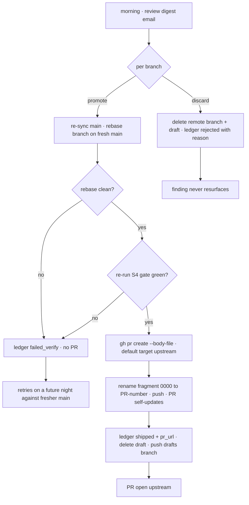
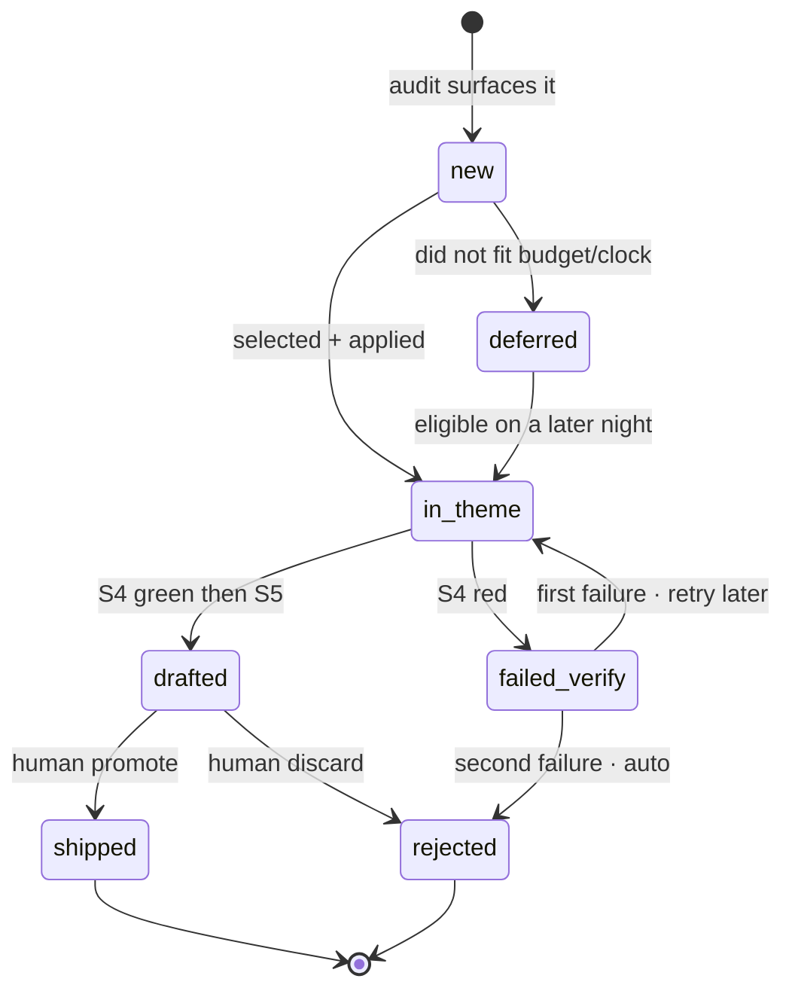
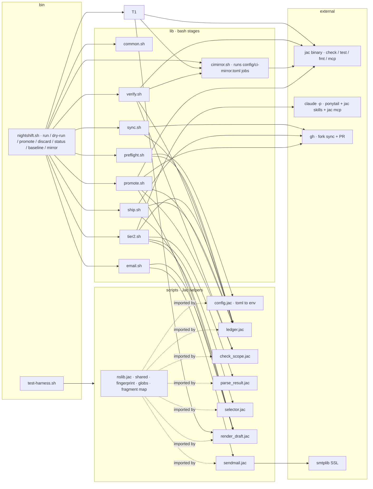

# Nightshift — Workflow

End-to-end map of the harness, current as of the v2 foundations work (2026-07-30): whole-repo
sharded audit, and an S4 gate that runs a local replica of the CI jobs a fork PR cannot reach.
Stages `S0–S6` run nightly and unattended; `S7` is the human morning loop.
Current design: `docs/superpowers/specs/2026-07-30-nightshift-4task-design.md`; open items:
`docs/superpowers/specs/2026-07-30-nightshift-followups.md`. `docs/PRD.md` and `docs/TechnicalPRD.md`
are pre-restructure and superseded for S3 onward (they carry banners saying so).

## 1. Nightly pipeline (S0 → S6)

```mermaid
flowchart TD
    LA["launchd 02:00 · user domain"] --> CAF["caffeinate -i · nightshift.sh run"]
    CAF --> CEIL["gtimeout 180m · hard wall-clock ceiling"]
    CEIL --> S0

    subgraph S0["S0 · Preflight"]
        direction TB
        LOCK["mkdir lock · check ~/.nightshift/DISABLE"]
        GATE0{"disabled or lock held?"}
        DEPS["resolve jac/claude/gh/git paths · gh auth · network probe"]
        NET{"online and gh authed?"}
        PONG{"claude -p pong ok?"}
        DRIFT["compare jac version vs state · warn on drift"]
        LOCK --> GATE0
        GATE0 -->|"yes"| EXIT
        GATE0 -->|"no"| DEPS --> NET
        NET -->|"no · exit 43"| EXIT
        NET -->|"yes"| PONG
        PONG -->|"no · exit 42"| EXIT
        PONG -->|"yes"| DRIFT
    end
    DRIFT --> S1

    subgraph S1["S1 · Sync"]
        direction TB
        SYNC["gh repo sync fork from upstream main"]
        CONF{"main diverged?"}
        WT["worktrees · work/repo on branches · work/drafts on orphan"]
        PRUNE["prune shipped/rejected branches older than 14d"]
        PULL["pull ledger.jsonl from drafts branch"]
        SYNC --> CONF
        CONF -->|"yes · exit 44"| EXIT
        CONF -->|"no"| WT --> PRUNE --> PULL
    end
    PULL --> S3

    %% S2 (tier-1 deterministic autofix) was RETIRED 2026-07-30. A byllm-only formatting PR was
    %% noise and a repo-wide one unmergeable (~259 pre-existing violations on main), and upstream
    %% only checks formatting repo-wide on push. Themes now format their own edits; [jobs.fmt]
    %% gates that diff-scoped, exactly as CI does on a PR.

    subgraph S3["S3 · Tier 2 · agentic clean"]
        direction TB
        ROT["shards list · 8 LOC-balanced shards of the whole repo · concurrency 2"]
        AUDIT["per shard · claude -p AUDIT · read-only · dontAsk · ponytail-audit scoped to the shard"]
        PJSON{"parse_result merge · any shard produced valid findings JSON?"}
        SEL["select.jac · drop ledger-known / protected / twice-failed · score loc*conf/risk · pack <=6 themes <=10 files <=600 LOC · fit clock"]
        APPLY["per theme · fresh branch + fresh claude -p APPLY · acceptEdits · scoped tools · NO push/gh/network · validate_jac before commit"]
        RJSON{"report JSON ok and diff non-empty?"}
        FRAG["orchestrator writes release-note fragment · dir mapped jac to jaclang etc · ledger upsert-theme · queue.tsv"]
        ROT --> AUDIT --> PJSON
        PJSON -->|"no · exit 50 · nothing ships tonight"| S4
        PJSON -->|"yes"| SEL --> APPLY --> RJSON
        RJSON -->|"no"| DROP3["delete branch · ledger failed_verify"]
        RJSON -->|"yes"| FRAG
    end
    FRAG --> S4
    DROP3 --> S4

    subgraph S4["S4 · Verify gate · fail-closed · per queued branch"]
        direction TB
        SCOPE{"scope contained? · diff subset of theme files + fragment · no protected"}
        CHK{"jac check baseline-diff ok? · new errors vs main only"}
        FAST{"CI mirror fast jobs ok? · fmt · check · jir · ~3s"}
        TST{"mirrored CI suites per gated suite · baseline-diff · one retry each"}
        PC{"pre-commit ok? · fold self-mutation"}
        CTRB{"CI mirror contribution ok? · AI co-author · no .py · bun lockstep · docs · fragment"}
        DISCARD["delete branch · ledger failed_verify++ · failed.tsv"]
        GREEN["green.tsv · record tests line · tune verify_estimate"]
        SCOPE -->|"no · possible injection"| DISCARD
        SCOPE -->|"yes"| CHK
        CHK -->|"no"| DISCARD
        CHK -->|"yes"| FAST
        FAST -->|"red · seconds, not 40min"| DISCARD
        FAST -->|"green"| TST
        TST -->|"red x2"| DISCARD
        TST -->|"green"| PC
        PC -->|"red"| DISCARD
        PC -->|"green"| CTRB
        CTRB -->|"red"| DISCARD
        CTRB -->|"green"| GREEN
    end
    GREEN --> S5

    subgraph S5["S5 · Ship to fork"]
        direction TB
        PUSH["git push fork · nightshift/branch · explicit refspec · never force"]
        DRAFT["render_draft · drafts/DATE--slug.md · ledger drafted"]
        PUB["commit + push drafts branch and ledger"]
        PUSH --> DRAFT --> PUB
    end
    PUB --> S6

    EXIT["EXIT trap · fires on any exit path"] --> S6
    DISCARD -.->|"all failed · exit 51"| EXIT

    subgraph S6["S6 · Email digest · always"]
        direction TB
        SUMM["sendmail summarize · assemble run summary from log dir + drafts"]
        DRY{"dry-run?"}
        SEND{"smtp SSL send ok?"}
        RENDER["print message · no send"]
        BAN["EMAIL_FAILED marker + osascript banner"]
        OK["digest delivered"]
        SUMM --> DRY
        DRY -->|"yes"| RENDER
        DRY -->|"no"| SEND
        SEND -->|"yes"| OK
        SEND -->|"no"| BAN
    end

    %% data stores
    LEDGER[("ledger.jsonl · fingerprint to status")]
    STATE[("state.json · verify_estimate · last_jac_version")]
    DRAFTSB[("nightshift/drafts orphan branch · drafts/*.md")]
    PULL -.->|read| LEDGER
    SEL -.->|read| LEDGER
    FRAG -.->|write| LEDGER
    DISCARD -.->|write| LEDGER
    GREEN -.->|tune| STATE
    DRAFT -.->|write| LEDGER
    PUB -.->|push| DRAFTSB
```

## 2. Morning human loop (S7)

The only path to upstream. Drafts are the queue: a draft file existing means the PR is not yet opened.

## 3. Finding lifecycle

Every finding is remembered across nights so work is never re-litigated.

## 4. Component and data map

bash sequences processes; Jac owns every data and logic transformation. No Python files.

