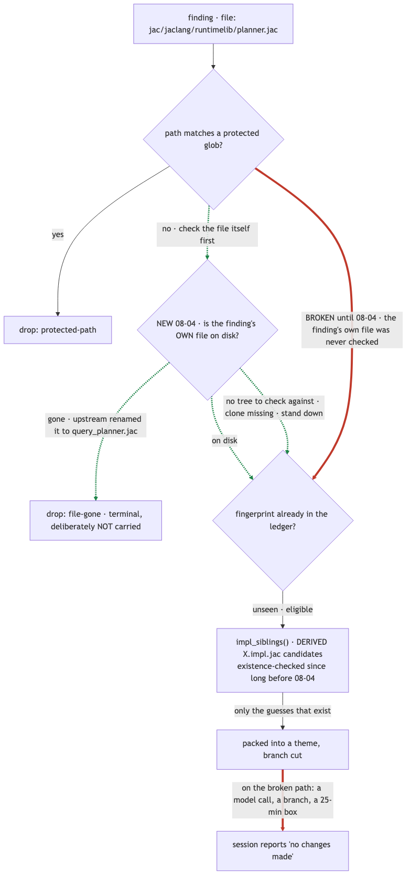

# Inside NightShift: the Night a Bug Killed the First Live Run

*Part 2 of 3. Part 1 has the general lessons: [What I Learned Building an Unattended Agent
Harness](2026-08-05-unattended-agent-harness-lessons.md). Part 3 is the pitch: [Why This Might
Matter Beyond One Repo](2026-08-06-nightshift-for-open-source.md).*

NightShift runs against [jaseci-labs/jac](https://github.com/jaseci-labs/jac) — roughly 365,000
lines of Jac across eleven packages, a compiler written in the language it compiles. Codebases that
size accumulate a specific kind of debt nobody is ever paid to fix: dead code with no caller left,
abstractions that were right two refactors ago, public code with no test touching it. Small,
unglamorous, and it loses every prioritization argument it's ever in. It's also work an agent can
do well — each item is small, local, and independently shippable as its own PR. What it isn't is
work anyone wants to babysit turn by turn.

So NightShift babysits it instead. Every night between 23:00 and 07:00, unattended:

- **Audit.** Sweep the repo through one of four rotating lenses — dead code, abstraction debt,
  maintenance rot, test coverage gaps — plus a reactive pass over whatever merged upstream *that
  day*, so freshly-landed code gets cleaned the same night it lands.
- **Select.** Score and group findings into themes worth a session, at a capped spend.
- **Apply.** Give each theme its own branch and its own fresh Claude Code session.
- **Gate.** Run every resulting branch through a local replica of the project's CI — the CI a fork
  PR can't actually reach — and throw away anything that doesn't go green.
- **Ship.** Push what survives as a *draft* PR. Never ready-for-review, never merged. A human
  merges, or nobody does.

That's the design. Here's the night it broke, and what the fix actually was.

## The first live night

2026-08-02 was the first night this pipeline ran for real, and it died at S3 — 25 minutes into an
8-hour window. By the time it died it had already done the expensive part: 12 merged upstream PRs
polled, 34 files audited, 29 findings produced, two apply sessions finished and committed,
$17.42 spent. Then the gate stage never ran, and nothing shipped. All of that work, gone.

The proximate cause was small: a function scoring findings hard-indexed one JSON key,
`est_loc_saved`. A coverage-lens finding carries different keys — `gap_severity`,
`est_loc_added`, `test_file` — because it's a different shape of finding, and had been since the
task registry landed. One function had never been updated to read both shapes; it raised a
`KeyError`; the apply script runs under `errexit`; the night ended there. It had been wrong for
four days and nobody had noticed, because no coverage theme had ever survived long enough to reach
that code path before.

The fix for *that* was three lines: read both key names explicitly, and fail loudly — not
`.get(key, 0)` — if a finding carries neither, because a finding matching neither known shape is
malformed and a silent zero is exactly the kind of bug that hides for four days.

But the three-line fix wasn't the important one. The important question was: why did one bad read
in a scoring function take down a night that had *already finished the real work*? The answer was
ordering. A bookkeeping write — recording the finding in the ledger — sat between the finished
apply work and the gate that would have shipped it. Any failure in that write, however unrelated to
the actual applied changes, stranded everything behind it. The restructure was to make the queue
write run first and stay fatal, and move the ledger write after it, non-fatal. Losing the ledger
row now costs one duplicate audit next time. Losing the queue used to cost the entire night.

## The second hole: budget only watched half the pipeline

A night later, a different gap showed up. `night_budget_usd` was gating the audit fan-out — how
many sessions got spent discovering findings — on the assumption that if discovery stayed inside
budget, everything downstream would too. It didn't. Apply sessions, the ones that actually spend
an agent session turning a finding into a diff, weren't checked against spend at all. On
2026-08-03 that meant $109.73 across 37 sessions, with 16 *apply* sessions run after the budget
brake had already fired at 00:19:30.

The fix was to make `tier2_apply` check spend per theme too, and fail closed — not silently
proceed — if the ledger it needs to check against is unreadable. A budget guard that only watches
one half of a two-phase pipeline isn't a partial guard; for the phase it doesn't watch, it's no
guard at all.

The same pass closed a second leak next to it: themes deferred at apply time — because the clock
or the budget guard tripped — were simply dropped instead of being retried later. They now merge
into the same carryover queue that selection-time deferrals already use, so a finding that didn't
get its turn tonight is still there tomorrow, at zero re-audit cost, instead of vanishing.

One more, found in the same cleanup: the selector's drop check looked at a finding's *derived*
sibling files — the `.impl.jac` candidates a `.jac` file might have — but never checked whether the
finding's own file still existed. A finding pointing at a path upstream had already renamed (say
`planner.jac` to `query_planner.jac`) sailed straight through selection, got packed into a theme,
burned a branch and a model call, and reported back "no changes made." Now the finding's own file
is checked first, and a finding whose file is gone is dropped as terminal — not carried forward to
waste the same session again tomorrow.

## Where it stands now

As of the 2026-08-04 night, the four-lens audit rotation runs alongside the reactive same-day
sweep, existing open PRs are re-gated and outrank generating fresh findings, and the carryover
queue — findings paid for but not yet applied — sat at 103 entries waiting their turn. The harness
still can't merge anything, still can't mark anything ready for review, and still writes down when
a stage didn't run rather than reporting a clean answer it doesn't have.

Neither of these bugs was exotic, and neither needed a smarter agent to catch. They needed the
harness to be honest about failure in the two places that mattered: what happens to already-finished
work when something small breaks downstream of it, and whether a budget guard actually covers the
full pipeline it's supposed to be guarding. That's most of what "unattended" turned out to mean in
practice — not that the agent works alone, but that the scaffolding around it has to fail the way
you'd want it to when nobody's there to catch it failing some other way.

Part 3 makes the case for why this pattern is worth more than one repo's backlog: [Why This Might
Matter Beyond One Repo](2026-08-06-nightshift-for-open-source.md).
